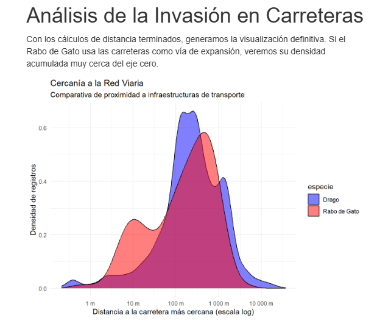
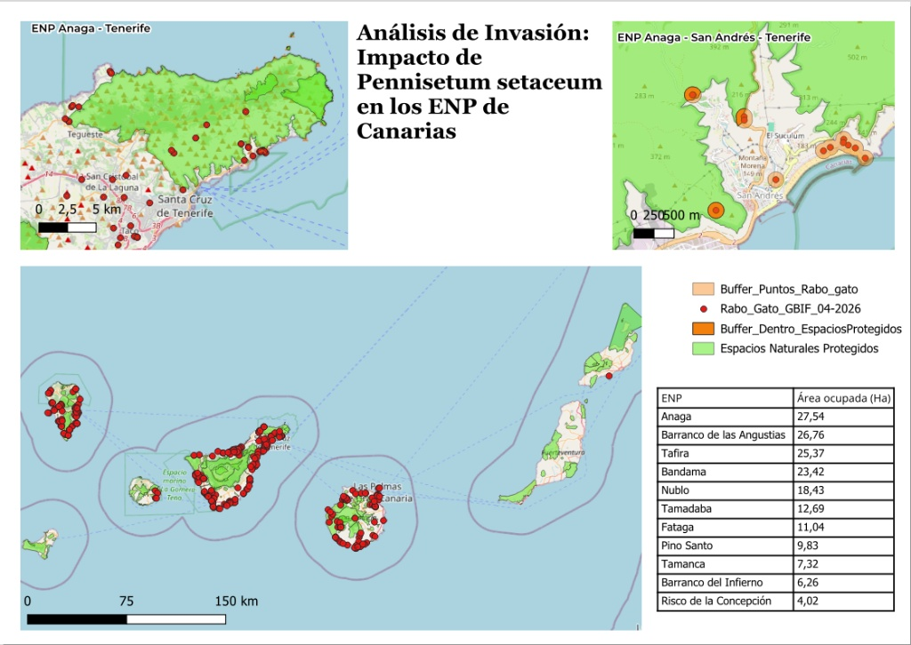
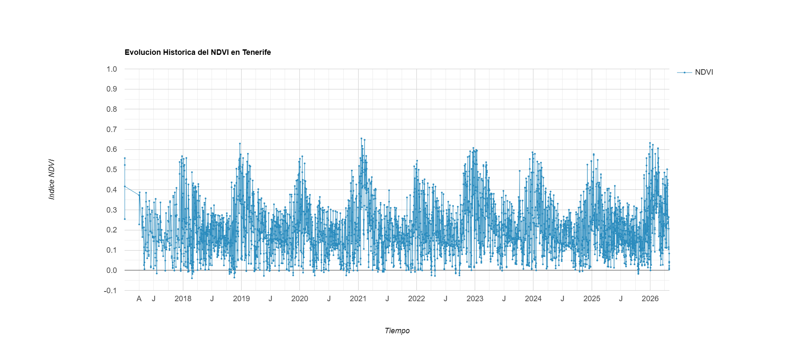

# Modelización Espacial y Análisis de Degradación Ecológica por *Pennisetum setaceum* en el Archipiélago Canario

Este proyecto presenta un flujo de trabajo analítico e integrado para evaluar el impacto ambiental y la expansión de la especie exótica invasora (EEI) **Rabo de Gato (*Pennisetum setaceum*)** en las Islas Canarias. Utilizando técnicas de biogeografía comparada, se contrasta su comportamiento espacial frente al endemismo protegido **Drago Canario (*Dracaena draco*)**.

El flujo de trabajo interconecta tres metodologías clave:
1. **Bioestadística y análisis de nicho** en RStudio.
2. **Geoprocesamiento e intersección territorial** en QGIS.
3. **Monitoreo dinámico multiespectral (NDVI)** mediante teledetección en la nube con Google Earth Engine.

---

## 🛠️ Estructura del Proyecto

### Bloque 1: Infraestructura de Datos de Biodiversidad y Ciencia Ciudadana

Para el mapeo de las especies se integraron macrodatos globales procedentes de **GBIF** (*Global Biodiversity Information Facility*), consolidando registros validados de la plataforma de ciencia ciudadana **iNaturalist** bajo el estándar de metadatos *Darwin Core*. 

El diseño metodológico contempló la corrección del **sesgo del esfuerzo de muestreo** (*sampling effort bias*), ya que un incremento puntual en el volumen de registros históricos suele responder a una mayor actividad de los usuarios (campañas, BioBlitz) y no a una expansión biológica real de la invasora. Las aplicaciones modernas actúan aquí como un "efecto paraguas", unificando bases de datos que históricamente se encontraban fragmentadas.

### Bloque 2: Fase RStudio – Análisis Estadístico de Nicho Ecológico

Utilizando la librería de última generación `terra` en RStudio, se transformaron las bases de datos crudas en vectores geoespaciales bajo el sistema de referencia **WGS84**. Se evaluó el comportamiento de ambas especies frente a variables biofísicas críticas:

* **Elevación y Pendiente:** El análisis de densidad kernel y diagramas de caja demostraron que *P. setaceum* exhibe un comportamiento oportunista en cotas bajas y pendientes moderadas, mientras que *D. draco* queda relegado a refugios naturales en escarpes y barrancos inaccesibles.
* **Disponibilidad Hídrica:** La invasora domina de manera absoluta los nichos hiperáridos por debajo de los 250 mm de precipitación anual, donde el Drago es casi inexistente.
* **Orientación Topográfica:** Las rosas de orientación constataron una plasticidad ecológica superior en el Rabo de Gato, distribuyéndose de forma radial homogénea sin verse limitado por la radiación solar directa.

#### Vector de Dispersión Antrópica (Red Viaria)
Se calculó la distancia geométrica euclidiana desde cada registro hasta el eje de carretera más cercano:
* **Drago Canario (1250 registros):** Distancia mediana de **252.27 metros**.
* **Rabo de Gato (337 registros):** Distancia mediana de **193.88 metros**.

Para validar la robustez de estos datos, se aplicó un test no paramétrico de **Wilcoxon-Mann-Whitney**:
* **Distancia a Carreteras:** $p = 4.39 \times 10^{-5}$ (Altamente significativo, confirma el asfalto como corredor de dispersión).
* **Altitud:** $p = 4.20 \times 10^{-53}$ (Confirma una segregación matemática de nichos absoluta).

---

### Bloque 3: Fase QGIS – Geoprocesamiento e Impacto Territorial

Los datasets optimizados se migraron a **QGIS**, reproyectando las capas al sistema de referencia de coordenadas local **WGS 84 / UTM zone 28N (EPSG:32628)** para obtener mediciones métricas exactas.

1. **Modelado de Presión:** Se generaron áreas de influencia (**Buffers de 2 km**) disueltas alrededor de los puntos de la invasora para delimitar su radio de afectación por dispersión de semillas.
2. **Intersección con la Red de Espacios Naturales Protegidos (ENP):** Se aislaron las superficies críticas de intrusión de la planta invasora dentro de los santuarios de biodiversidad.

#### Superficie afectada por la invasora en los ENP (Datos del Modelo):
* **Macizo de Anaga (Tenerife):** 27,54 Ha
* **Barranco de las Angustias (La Palma):** 26,76 Ha
* **Tafira (Gran Canaria):** 25,37 Ha
* **Bandama (Gran Canaria):** 23,42 Ha
* **Nublo (Gran Canaria):** 18,43 Ha
* **Tamadaba (Gran Canaria):** 12,69 Ha

---

### Bloque 4: Fase Google Earth Engine – Teledetección Multiespectral

Utilizando las zonas críticas de QGIS como máscaras de recorte, se programaron scripts en la nube de **Google Earth Engine (GEE)** para procesar la serie temporal de imágenes de reflectancia en superficie de la constelación **Sentinel-2 (Copernicus)**, aplicando máscaras de calidad atmosférica (*QA60*).

Se modeló de forma automatizada la evolución del **Índice de Vegetación de Diferencia Normalizada (NDVI)**:
* **Comportamiento en Diente de Sierra:** La serie histórica desveló un patrón estacional extremo. La invasora genera picos de actividad fotosintética en épocas húmedas, pero sufre un desplome vertical en el periodo estival, cayendo a valores mínimos críticos en el entorno de **0.30**.
* **Diagnóstico Biofísico:** Este agostamiento masivo de la planta invasora desploma la resiliencia del suelo, incrementando exponencialmente el riesgo de erosión hídrica superficial y generando un volumen crítico de combustible fino altamente inflamable en zonas de alto valor ecológico.

---

## 📈 Conclusiones Estratégicas

1. **Evidencia Viaria:** Las carreteras no solo fragmentan el territorio, sino que actúan como vectores dinámicos que aceleran la colonización de *Pennisetum setaceum*.
2. **Priorización de Recursos:** Espacios como el Macizo de Anaga requieren intervenciones de choque inmediatas al registrar la mayor tasa de ocupación absoluta (27,54 Ha) en zonas de solapamiento potencial con flora nativa.
3. **Eficiencia Tecnológica:** La integración de análisis estadístico local junto con la computación geoespacial cloud (GEE) ofrece un marco metodológico reproducible y de alta precisión para la auditorías de impacto ambiental.
