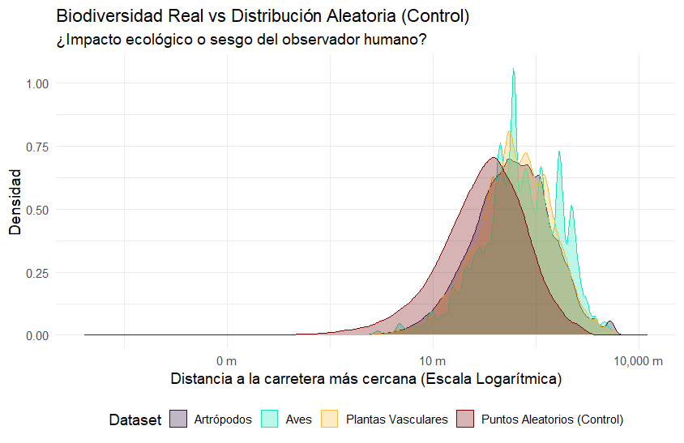

# 🗺️ Análisis Espacial Avanzado: Efecto Borde y Sesgos de Muestreo en la Biodiversidad de Canarias (2000 - 2026)

## 📌 Descripción del Proyecto

Este proyecto de investigación personal evalúa de forma cuantitativa la proximidad de la biodiversidad registrada en las Islas Canarias respecto a la infraestructura viaria principal y secundaria. El objetivo inicial era medir el impacto del "Efecto Borde" (*edge effect*) sobre tres grupos taxonómicos (Aves, Artrópodos y Plantas Vasculares).

Sin embargo, tras procesar **Big Data espacial (+1.1 millones de registros)**, el análisis evolucionó hacia una auditoría metodológica crítica. Mediante el uso de un **modelo nulo de control geográfico** y una comparativa inter-taxonómica, el proyecto demuestra cómo la fragmentación del territorio insular y los sesgos inherentes a la ciencia ciudadana pueden enmascarar o distorsionar los patrones ecológicos reales si los datos se analizan de forma ingenua.

---

## 🛠️ Stack Tecnológico y Herramientas GIS

Para optimizar los recursos computacionales y garantizar la precisión cartográfica, el pipeline de datos se dividió de forma híbrida:

* **R (v4.x) & RStudio:** Tratamiento de Big Data, optimización de memoria RAM mediante filtrado por bloques (*chunk processing*), manipulación de datos espaciales (`sf`, `tidyverse`) y análisis estadístico y gráfico descriptivo avanzado (`ggplot2`).
* **QGIS (v3.x):** Inspección de geometrías, control de calidad cartográfica mediante el filtrado de registros erróneos en el mar (*spatial clip*) y validación visual de la red viaria.

### Geodatasets Utilizados:
* **GBIF (Global Biodiversity Information Facility):** Datos de presencia biológica filtrados temporalmente desde el año 2000 hasta la actualidad (2026).
* **Geofabrik / OpenStreetMap:** Capa vectorial de carreteras completas del archipiélago (`canary-islands-260607-free.shp` / subcapa `gis_osm_roads_free_1`).

---

## 📁 Estructura del Repositorio

Para garantizar la replicabilidad del análisis, el proyecto se organiza de la siguiente manera:

```text
├── data/
│   ├── raw/                 # Archivos originales de GBIF y Geofabrik (No subidos por peso)
│   └── processed/           # Capas espaciales intermedias filtradas (.gpkg)
├── scripts/
│   ├── 01_data_cleaning.R   # Pipeline de lectura por chunks, filtrado temporal y espacial
│   ├── 02_hub_distance.R    # Cálculo geométrico de proximidad a carreteras (CRS: 32628)
│   └── 03_control_model.R   # Generación del modelo nulo aleatorio y analítica final
├── outputs/
│   ├── tables/              # Matrices estadísticas de resumen exportadas
│   └── plots/               # Gráficos de densidad generados (PNG de alta resolución)
└── README.md                # Documentación principal del proyecto
```
---

<h2>Metodología y Pipeline de Desarrollo</h2>

El proyecto se ejecutó en tres fases críticas para garantizar la reproducibilidad y optimizar el rendimiento de la máquina local ante la carga de Big Data.

<h3>Fase 1: Ingesta Eficiente y Limpieza de Big Data (R)</h3>

El dataset original de aves presentaba un volumen crítico de **~5 GB**, inviable para una lectura secuencial directa en la memoria RAM estándar.

* **Procesamiento por Bloques:** Se diseñó un script en R utilizando funciones de lectura indexada para trocear el archivo original. El algoritmo leyó y filtró los registros en memoria en un bucle optimizado durante más de 1 hora de computación local.
* **Filtros Aplicados:** Restringido estrictamente al periodo **2000 - 2026**, exclusión de registros marinos erróneos mediante una máscara espacial y reducción dimensional de variables clave (`scientificName`, `decimalLatitude`, `decimalLongitude`, `year`).

<h3>Fase 2: Geoprocesamiento y Análisis de Proximidad (QGIS / SF)</h3>

Con los datasets limpios y homogeneizados en formato GeoPackage (`.gpkg`), se procedió al análisis espacial métrico:

1. **Reproyección a Sistema Métrico:** Toda la cartografía se proyectó al sistema de referencia oficial del archipiélago: **REGCAN95 / UTM zona 28N (CRS: 32628)** para evitar las distorsiones métricas del sistema WGS84 tradicional.
2. **Cálculo de Distancia al Eje:** Se ejecutaron algoritmos de búsqueda del vecino más cercano vectorizado (`st_nearest_feature` y `st_distance`). Para cada punto biológico se calculó la distancia métrica exacta a la carretera más cercana, generando la variable numérica `HubDist`.

<h3>Fase 3: Validación Mediante Modelos de Control</h3>

Para evitar conclusiones sesgadas por la naturaleza intrínseca de los datos, se programaron dos controles:

* **Modelo Nulo Espacial:** Generación de 100.000 puntos aleatorios para evaluar la densidad base de la red de carreteras.
* **Análisis de Sesgo Taxonómico:** Contraste de densidades entre grupos con alta influencia de ciencia ciudadana (Aves) frente a muestreos sistemáticos de campo (Artrópodos).

---

<h2>Resultados y Discusión Crítica</h2>

Tras cruzar los datos biológicos con el modelo nulo de control, se obtuvieron las siguientes métricas descriptivas iniciales en la consola de RStudio:

* **Artrópodos:** 39.3% de los registros a menos de 100 metros del asfalto (distancia mediana de solo 143 m).
* **Plantas Vasculares:** 35.0% en la franja crítica (distancia mediana de 155 m).
* **Aves:** 31.0% en zona de impacto inmediato (volumen absoluto de +260.000 puntos).

<h3>Análisis del Perfil de Densidad de Distancias</h3>

Para interpretar estos números se generó un gráfico de densidades en escala logarítmica, contrastando la distribución real frente al modelo aleatorio nulo:



El análisis del gráfico desmonta la hipótesis simplista del impacto lineal de las infraestructuras y revela dos fenómenos metodológicos clave:

1. **La Condición Geográfica Insular:** La curva de puntos aleatorios se sitúa notablemente desplazada hacia la izquierda (menor distancia). Esto demuestra que la red de carreteras de Canarias es tan densa y el territorio tan acotado que, estadísticamente, **cualquier elemento aleatorio en las islas está abocado a estar cerca del asfalto**. La cercanía física inicial no es un comportamiento puramente ecológico, sino una propiedad geométrica del territorio.
2. **El "Efecto Huida" de la Biodiversidad:** Las curvas de los tres grupos biológicos están desplazadas **hacia la derecha** respecto al azar. Esto significa que los organismos vivos muestran una resistencia distributiva: se acumulan a distancias mayores de las carreteras de lo que predeciría el modelo nulo, buscando refugio en los reductos naturales mejor conservados.
3. **El Sesgo del Observador:** La curva de las **Aves** (turquesa) presenta un pico vertical y estrecho pegado a las carreteras, evidenciando el sesgo de accesibilidad de la ciencia ciudadana (muestreo cómodo desde vías). Por el contrario, los **Artrópodos** (morado) presentan una curva mucho más achatada y distribuida hacia el interior, reflejando el rigor de los muestreos sistemáticos llevados a cabo por profesionales en zonas de difícil acceso.

---
---

<h2>Aplicación Práctica: Detección de Vacíos de Información (Gap Analysis)</h2>

Más allá del análisis de distancias, este pipeline cartográfico se ha diseñado para actuar como una herramienta de toma de decisiones en la gestión ambiental, específicamente en la **identificación de vacíos de datos cartográficos**. 

Al cruzar la densidad de puntos reales de GBIF con la red viaria, el modelo permite aislar geográficamente aquellas cuadrículas de alto valor ecológico que presentan un número de registros cercano a cero. Esto transforma el análisis estadístico en una guía de acción en el territorio.

<h3>Estrategia para Proyectos de Recogida de Datos en Campo:</h3>

* **Zonas de Sombra Inaccesibles:** El análisis demuestra la existencia de "puntos ciegos" en el interior de los macizos más abruptos de las islas (zonas alejadas de la red `gis_osm_roads_free_1`). El proyecto sirve como base científica para justificar la necesidad de financiar expediciones botánicas y entomológicas profesionales en estas áreas de difícil acceso.
* **Optimización de Ciencia Ciudadana:** Al geolocalizar los cuadrantes donde faltan datos de aves pero que están relativamente cerca de senderos homologados, se pueden diseñar campañas de "Ciencia Ciudadana Dirigida", incentivando a los usuarios de plataformas como eBird o iNaturalist a realizar avistamientos en zonas prioritarias en lugar de repetir las rutas tradicionales hiper-muestreadas.
* **Planes de Acción y Financiación:** Este enfoque metodológico ofrece a las administraciones públicas (Cabildos, Consejerías de Transición Ecológica) una cartografía de prioridades basada en evidencias estadísticas para la inversión eficiente en la recolección de datos sobre biodiversidad.

---

<h2>🔮 Futuras Líneas de Trabajo (Explotación del Dataset)</h2>

La base de datos descargada de Geofabrik contiene múltiples capas vectoriales adicionales que abren la puerta a expansiones automáticas de este pipeline:
* **Análisis por Categoría de Vía:** Clasificar el impacto segregando las autopistas principales de las pistas de tierra forestales para evaluar si el "efecto huida" varía según el índice de tráfico.
* **Modelado de Usos del Suelo:** Cruzar los puntos de presencia biológica con las capas de áreas urbanas, zonas industriales y coberturas vegetales del suelo presentes en el `.shp` para desarrollar un Modelo de Idoneidad de Hábitat (SDM) completo.

---

<h2>Conclusiones </h2>

*  Este proyecto demuestra que el análisis masivo de datos espaciales en plataformas globales como GBIF requiere obligatoriamente una deconstrucción de sesgos. Aplicar algoritmos GIS de forma automática sin un modelo de control nulo conduce a conclusiones ecológicas erróneas.
* **Habilidades Demostradas:** Capacidad de optimización de código en R para computación pesada local, diseño metodológico de modelos nulos espaciales, integración avanzada R-QGIS y análisis crítico orientado a la resolución de problemas y propuestas de proyectos en el mundo real.
